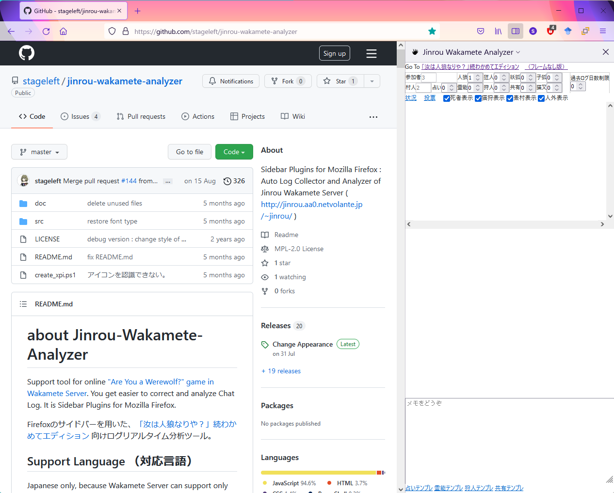
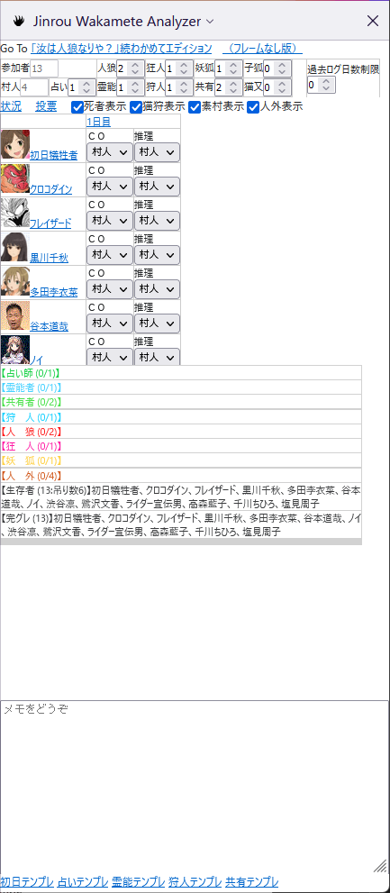
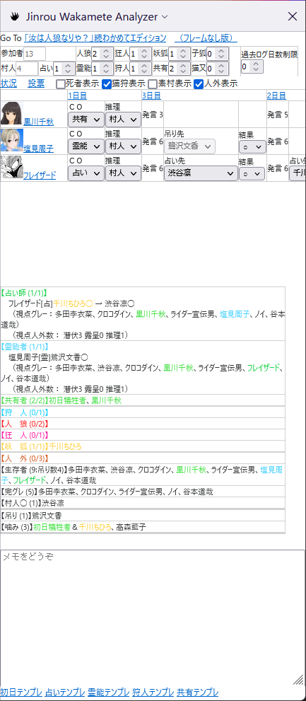
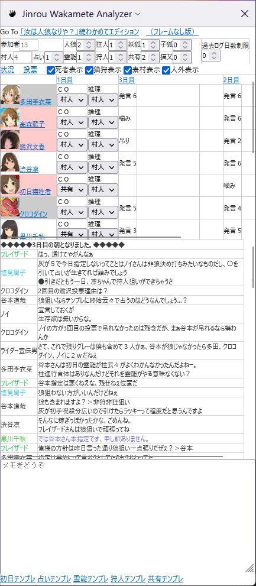
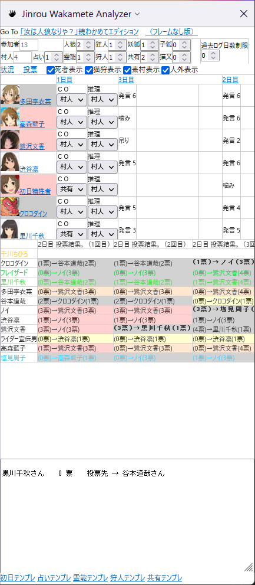
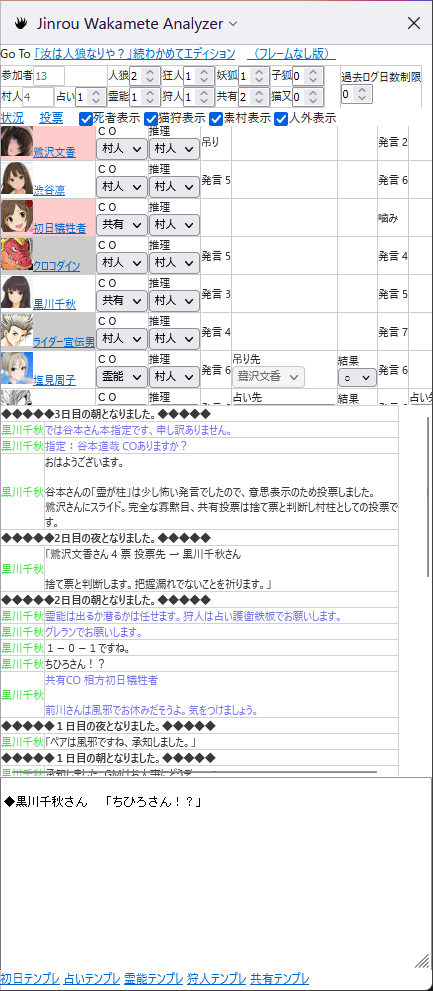
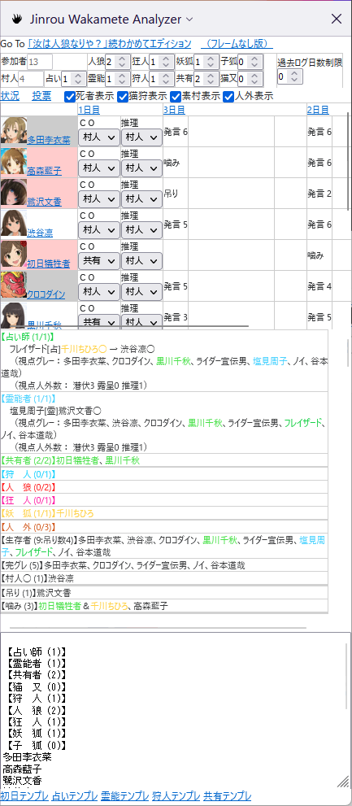
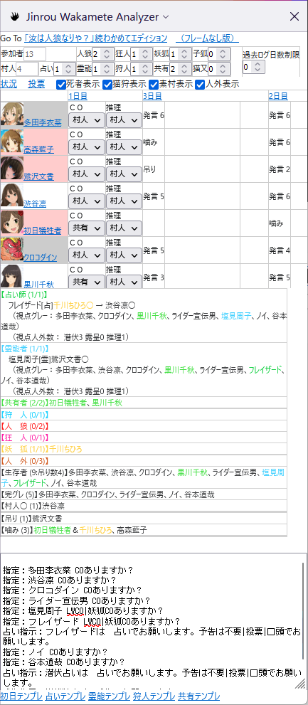
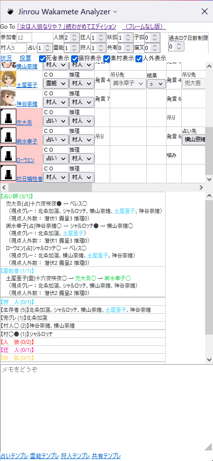
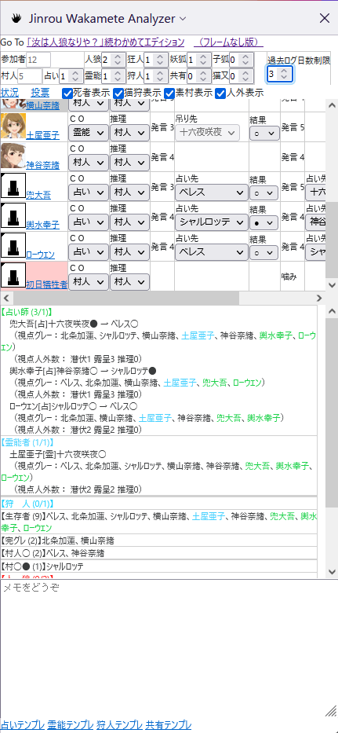

# about Jinrou-Wakamete-Analyzer

Support tool for online ["Are You a Werewolf?" game in Wakamete Server](http://jinrou.aa0.netvolante.jp/~jinrou/).
You get easier to correct and analyze Chat Log.
It is Sidebar Plugins for Mozilla Firefox.

Firefoxのサイドバーを用いた、[「汝は人狼なりや？」続わかめてエディション](http://jinrou.aa0.netvolante.jp/~jinrou/) 向けログリアルタイム分析ツール。

## Support Language （対応言語）

Japanese only, because Wakamete Server can support only Japanese.

わかめてサーバが日本語なので、日本語以外対応しません。あしからず。

## Request for you （お使いの皆様へお願い事項）

まず、バグ報告についてのお願いです。

1. *村番号の控え* 、および、状況発生時の *スクリーンショットの取得* をお願いします。
1. 基本的には [GithubのIssueチケット](https://github.com/stageleft/jinrou-wakamete-analyzer/issues) による報告をお願いいたします。  
   作者によるバグ調査の際は、村のログおよびスクリーンショットが必要となります。
    * Github アカウントをお持ちでない等、 Issue チケットを操作できない事情がある場合は、別途個別対応とさせてください。
      [X(Twitter):@elderalliance](https://X.com/elderalliance) へ一報いただけると、初期対応が一番早いです。

次に、機能の強化および削除に関する要望についてのお願いです。

1. 要望は、基本的にバグ報告と同様、 Issueチケット による報告をお願いいたします。  
1. 要望がある場合は、内容および理由について、できるだけ具体的に記載願います。
    * 技術的困難度および将来拡張性の観点から、要望の内容と全く異なる形での対応を行う場合があります。
1. 採用されなくても泣かないでください。
    * 技術的困難度、レイアウト、および将来拡張性の展望から、採用できない要望も多数考えられます。
    * 採用できない場合は、原則として採用できない理由を Issue チケットに残します（あるいは、すでに残っているかもしれません）

## How to Install （どうやってインストールするの？）

### Install （普通にインストールする場合）

[Firefox拡張機能インストールページ](https://addons.mozilla.org/ja/firefox/addon/jinrou-wakamete-analyzer/) からインストールしてください。

### Update （インストールしたものを最新化する場合）

1. アドオンマネージャー（ about:addons ）にアクセスし、インストールされている Jinrou Wakamete Analyzer のバージョンを確認してください。  
   右上のメニュー（横線３本アイコン）→アドオン、あるいは、Ctrl+Shift+Aでもアクセスできます。
1. [Firefox拡張機能インストールページ](https://addons.mozilla.org/ja/firefox/addon/jinrou-wakamete-analyzer/)  にアクセスし、
   「詳しい情報」メニューから最新バージョンを確認してください。  
   バージョンが同じであれば、最新化されていますのでここで終わりです。
1. アドオンマネージャー、先程バージョンを確認した画面にて、設定アイコン（右上の歯車）から「今すぐ更新を確認」をクリックします。
1. 同じ画面にて、インストールされている Jinrou Wakamete Analyzer のバージョンが最新と一致していれば完了です。

### Temporarily install for your Development（自分でカスタマイズしたい場合）

1. 本ページ右上（右中？）の、「Clone or download」から、Download ZIP にてファイルをダウンロードする。
1. ファイルを解凍し、ソースコードを適宜編集する。
1. [MDN Web Docs : 初めての拡張機能 ～パッケージ化と公開～](https://developer.mozilla.org/ja/docs/Mozilla/Add-ons/WebExtensions/Your_first_WebExtension#packaging_and_publishing) より
   [Package your extension](https://extensionworkshop.com/documentation/publish/package-your-extension/) へアクセスして必要なファイル一式をZip圧縮、
   [Temporary installation in Firefox](https://extensionworkshop.com/documentation/develop/temporary-installation-in-firefox/) に従いインストールする。  
   なお、起動のたびにインストールする必要がある。
1. 満足の行くカスタマイズができた場合、ご自身でカスタマイズしたパッケージを配布し、通常の拡張機能としてインストールすることができる。
   [Distribute pre-release versions](https://extensionworkshop.com/documentation/publish/distribute-pre-release-versions/) および
   [Submitting an add-on](https://extensionworkshop.com/documentation/publish/submitting-an-add-on/) を参照すること。
    1. このとき、 manifest.json はご自身の情報に合わせて必ず書き換えること。

## How to Use （どうやって使うの？）

本説明は、バージョン v2.5 以降についての説明であり、お使いのバージョンと異なる可能性がある。

### （参考）マシンスペック推奨値

ツール導入後、過去ログ読みを行い、マシンスペックの適合性を動作確認することを推奨いたします。（人数多め、占いCO数多めの村を推奨いたします）
マシンスペックが適合しない場合、ログの取り込みが遅れる、プルダウンメニューの選択ができない（後述の推理表を更新できない）等、人狼ゲームプレイへの影響が懸念されます。

* 以下の条件で、ブラウザのCPU使用率が初期値25%程度、定常値で5～15%前後でした。
  * CPU：Intel Core i5-8250U （ノートPC）
  * メモリ：8GB（メモリ使用量は6GB程度）
  * ディスク：SSD（スワップは切っており、負荷は確認されていない）
  * 計測条件： １６人村 [155062番【モバマス】最終幻想人狼村](http://jinrou.aa0.netvolante.jp/~jinrou/kako/155062.html) の過去ログ読み。タスクマネージャーにて、プロセスCPU使用率を目視。
* Webページの拡大率を100%として利用する前提にて、ブラウザサイズ 1280 x 1024 以上を確保できるディスプレイを推奨します。

### 基本的な使い方１・村参加時の操作サポート

通常のゲームプレイに対して、以下の操作性変更が加わっている。

1. 村の進行に合わせてログは自動で更新され、取り込まれる。  
   ただし、自動更新の周期は１０秒周期と遅いため、必要に応じて手動で更新することが望ましい。  
   1. 発言入力中に自動更新周期が訪れた場合、自動更新は行わない。  
      また、その後手動での更新（発言を含む）を行わない限りは、改めての自動更新は実施しない。  
      * 注意事項：自動更新中に文字を入力すると、入力した内容が不正に削除されることがある。  
        自動更新を止めるためには、自動更新タイミングの前に、自ら更新する、発言を入力する、といった操作を行う。
   1. 夜の占い師は、占い完了するまで自動更新は行わない。いいからすぐ占え。
   1. 行動内容あるいは行動対象の変更は、発言入力と同等に、自動更新の停止フラグとしてみなす。  
1. 発言の入力時、１行あたりの文字数が４０文字を超えると、文字入力エリアが赤くなる（webカラー名 pink）。  
   
   これは、潜在的にわかめてサーバ禁止行為の【ログ破壊】リスクがあることを意味する。  
   ただしリスク検出のみであり、必ずログ破壊になるとは限らないので、そのまま発言することに支障はない。
1. 発言の入力時、行動内容が「発言 \[発言内容\]」かつ、行動対象が「------------」以外である（行動対象がどなたか選択されている）場合、「行動/更新」ボタンの文字が赤くなり（カラーコード #ff0000）、押下が禁止される。  
   
   * この機能は、投票漏れを防ぐための注意喚起機能である。行動内容を「投票」に変更し忘れたまま更新し、 **投票したつもりになる突然死事故** を防ぐ機能となる。
   * 行動/更新ボタンを改めて押下可能とするには、行動内容を別のものに変更する。
   * 「行動/更新」ボタンの押下禁止中は、上記自動更新機能の「行動内容あるいは行動対象の変更」実施中であり、自動更新が停止されている点に注意する。  

### 基本的な使い方２・村参加時の推理サポート

スクリーンショットは、村（[153535番【モバマス】年の瀬村](http://jinrou.aa0.netvolante.jp/~jinrou/kako/153535.html)）の状況である（デバッグモードにて作成）。

1. 起動（サイドバー表示）直後の状態は以下の通り。
   

1. サイドバーを表示する（下図）。  
   サイドバー上部の「Go To 「汝は人狼なりや？」続わかめてエディション」をクリックすることで、同サイトにアクセスする。
     
   同じく「（フレームなし版）」をクリックすることで、同サイトのフレームなし版にアクセスすることも可能。（2021/07現在、サイトのURL移動が不完全なようで、不要なロードがしばらく続くため非推奨）

1. 村民登録を行い、ゲームの開始を待つ。  
     
   このとき、ツールの仕様の都合上、以下の注意点がある。  
    1. 複数のウィンドウを開いてはいけない。
    1. 複数の画面で村および過去ログを見てはいけない。

1. 村が始まったところで、サイドバーの上部に配役が入力され、CO状況のまとめ表がサイドバー中央下部に表示される（詳細は、サイドバー中央下部の状況表示領域説明にて後述する）。  
    1. 以下の設定の配役が入力されているが、ご自身の村の配役に合わせ、適宜訂正すること。  
       ８～１１人「妖狐なし」  
       １２～１３人「狐増える（妖狐増える増える）」  
       １４人～１７人「妖狐あり」  
       １８人～３０人「猫又あり」  
    1. 配役横の「過去ログ日数制限」は0であることを確認しておくこと。  
     

1. サイドバー中央上部の **推理表** に、村の進行状況に合わせて必要な情報を適宜入力していく。
    1. 「１日目」の列、各参加者のプルダウンメニューを選択し、CO状況、人外の推理状況、を選択入力する。  
       また、合わせて、各日の占い結果・霊能結果もプルダウンメニューにて同様に選択入力する。  図は３日目昼時点での状態であるが、後に示す操作にて表示を絞り込んでいる。
         
    1. 推理表の詳細な仕様は以下のとおり。
        1. 日数は１日目を除き、逆順で表示される。名前と近い側に、入力すべき最新情報があると認識すること。  
        1. 各々の日付では、占い結果・霊能結果の入力メニュー以外に、当日の発言数が表示されている。  
           死亡・復活当日においては、その理由を表示する。  
           ただし、最終日の表示が不適切なことがある。
        1. 参加者名のセルについて、以下の色分けをしている。  
            1. 死者は赤セル（カラーコード #ffcccc）である。
            1. 役職CO・人外推理がなく、占い師からの占い判定結果もない生存者は、
               灰色セル（カラーコード #cccccc）である。
            1. 役職CO・人外推理がなく、１名以上の占い師から●（人狼判定）をもらっている生存者は、
               黒セル（カラーコード #888888）である。
            1. 上記以外は、
               白セル（カラーコード #ffffff）である。
        1. 推理表上部の、「死者表示」「猫狩表示」「素村表示」「人外表示」各々のチェックボックスを用いて、表示する参加者の絞り込みを行うことができる。  
           上の「３日目昼」スクリーンショットは、死亡者と素村を表示から除外し、表示を絞り込んだもの。
            1. 「死者表示」チェックボックスを外すと、推理表の参加者リストから、死亡者を確認できなくなる。
            1. 「猫狩表示」チェックボックスを外すと、推理表の参加者リストから、 **共有者** 、猫又、狩人のCO者を確認できなくなる。
            1. 「素村表示」チェックボックスを外すと、推理表の参加者リストから、村人を確認できなくなる。
            1. 「人外表示」チェックボックスを外すと、推理表の参加者リストから、人外推理者を確認できなくなる。

（参考）本ツール全体の思想として、多人数村にて「グレラン」と呼ばれる投票指示に効率よく対応することを最大の目標としている。  
このため、推理表においては見やすさより入力しやすさを優先し、見やすさについては、下記の状況表示領域を併用することにより担保している。

1. サイドバー中央下部の **状況表示領域** は、配役情報、村のログ、および推理表の入力に応じて、推理に役立つ情報が適宜表示される。
    1. 状況表示領域は、「状況表示」「投票表示」「発言表示」の３つのモードが存在する。
    1. 状況表示モードへは、推理表上部「状況」のリンクをクリックすることで遷移する。表示イメージは、推理表の項を参照。
        1. 各役職者については、【役職名(x/y)】との表示であり、xはCO者または推理入力された人外、yは配役数となる。  
           xがyより小さい場合は未CO者がいる（推理入力が不足している状態）、xがyより大きい場合はCO者に騙りが含まれる、と推測する。
        1. 人外（役職不明）についても同じように、【役職名(x/y)】との表示となる。xは推理入力された人外であるが、yは人外数全体から、各人外配役で。  
           つまり、推理入力が完全であることを前提に、 y-x で未発見人外数を確認できる。
        1. 生存者について、【生存者(x:吊り数y)】との表示となる。xは生存者数、yは吊り数である。
           上記「人外」項をあわせて参照し、●吊り●人外を容易に確認できる。
        1. それ以降、【完グレ(x)】【村人◯(x)】【村人●(x)】【村◯●(x)】と続く。各々xは生存する当該者の数である。
        1. さらに、【吊り(x)】【噛み(x)】【死体(x)】【復活(x)】と続き、表示項目はここまでとなる。各々xは当該者の数である。
           * 吊りは猫又による呪いを含む。
           * 噛みは呪殺・猫噛み死体を含む。
           * 死体は「死神手帳」対象者を意味する。
           * 復活は猫又の「2日目以降の夜に死んだ人を指定して生き返す事がある。」対象者を意味する。
           * 突然死はいずれにも含まれない。  
        1. 役職CO者、人外推理者については、名前および投票結果に文字色がつく。文字色は、わかめて過去ログの役職者に準ずる。
           人外推理者は人狼とも妖狐ともつかない色（カラーコード #cc4400、橙色～琥珀色）をつけている。
    1. 投票表示モードへは、推理表上部「投票」のリンクをクリックすることで遷移する。  
         
        1. 投票は日付順・投票回数順で表示される（推理表と異なり、逆順ではない）。
        1. 役職CO者、人外推理者については、名前および投票結果に文字色がつく。文字色は状況表示モードと同じものとする。
        1. 本ツールがグレランと判断した場合、その投票には以下のセル色がつく。
            * 最多得票者へ投票した、役職CO者以外のセル → 赤を薄くした色（カラーコード #ffcccc）。
            * 役職CO者以外で得票0票者のセル → 黄色を薄くした色（カラーコード #ffffcc）。
            * 上記２つに両方当てはまる者のセル → 上記２つの中間色（カラーコード #ffe4cc）。
            * それ以外のセル → 灰色（カラーコード #cccccc）。
            * （参考）本ツールでのグレラン判断基準は、「最多得票者の得票数が、投票者の半分未満」と定義する。  
              したがって、全ランなど特に指示がない投票もグレランに含むことがあり、また、消極的村柱投票で得票が集中しすぎた場合はグレラン指示があってもグレランに含まない。
        1. 本ツールが２回連続グレランと判断した場合に、役職CO者以外が投票先の変更を行った場合、文字フォントを変更する
           （モノスペース・太字）。
    1. 発言表示モードへは、推理表内、参加者の名前、または、日付をクリックすることで遷移する。  
         
        1. 図は日付をクリックした場合のもの（参加者名をクリックした場合の図は後掲）。わかめてサーバと同様に、下から日付順にて表示される。
        1. 役職CO者、人外推理者については、名前および投票結果に文字色がつく。文字色は状況表示モードと同じものとする。
        1. 「発言強く」および「発言弱く」も同様に表示されるが、「発言弱く」は発言強調に利用されている実情を顧みて、通常発言と同じフォントサイズとしている。
        1. 夜の会話については、参加者から見えているもののみ表示される。
        1. 日付の区切りは「◆◆◆◆◆ 日付説明 ◆◆◆◆◆」と表示される。
        1. 日付をクリックして遷移した場合、前日夜と当日朝の組み合わせにて表示する（例：２日目は、１日目夜と２日目朝を表示対象とする）。

1. サイドバー下部にはメモエリアを準備している。
   このメモエリアに連携して、状況表示領域エリアの内容、および、役職者の発言テンプレートを書き出す機能がある。
   本機能での内容書き出しを行った場合、以下の書き出し内容が追記される（元の記載内容は保持される）。  
   適宜編集し、推理メモあるいは発言に用いられることを想定している。
    1. 状況表示モードの場合、状況表示領域に示された特定の状況をクリックすると、その状況のみがメモエリアに書き出される。  画像は「占い師」の欄をクリックしたもの。  
         
    1. 投票表示モードの場合、状況表示領域に示された特定の投票をクリックすると、その投票のみがメモエリアに書き出される。  
         
    1. 発言表示モードの場合、状況表示領域に示された特定の発言をクリックすると、その発言のみがメモエリアに書き出される。  
         
    1. メモエリア下部、「初日テンプレ」のリンクをクリックすると、役職一覧および参加者一覧がメモエリアに書き出される。  
         
    1. メモエリア下部、「占いテンプレ」のリンクをクリックすると、占い師の発言テンプレートがメモエリアに書き出される。  
         
    1. メモエリア下部、「霊能テンプレ」のリンクをクリックすると、霊能者の発言テンプレートがメモエリアに書き出される。  
         
    1. メモエリア下部、「狩人テンプレ」のリンクをクリックすると、狩人の発言テンプレートがメモエリアに書き出される。  
         
    1. メモエリア下部、「共有テンプレ」のリンクをクリックすると、共有者の発言テンプレートがメモエリアに書き出される。  
         

1. 細かいテクニックとしては、以下のポイントを押さえるとよい。
    1. 推理表入力について、CO状況の入力は早めに行うとよい。  
       推理表上部のチェックボックス、および、状況表示領域の発言表示モードを効率的に用いると、占い結果・霊能結果は後からでも効率的に入力できる。  
    1. メモ帳はやっぱり必要。  
       メモエリアがあるからと言って、考え方の整理に役立つほどのスペースがあるわけではない。発言バックアップおよび状況表示書き出しで利用することも考慮する。

### 応用的な使い方・村の過去ログを読む

スクリーンショットは、 村（ [153254番【モバマス】風林火山村](http://jinrou.aa0.netvolante.jp/~jinrou/kako/153254.html) ）の状況である。

1. 村の過去ログを表示する。サイドバーから行く必要は特にない。
1. 基本的な使い方と同様に、推理表や状況表示領域を活用しながら読んでいく。  
   ただし、過去ログであるがゆえに、全体状況がすでに表示されてしまっている点、非生存の参加者が墓アイコンになってしまっている点に注意する。  
     
1. 推理表や状況表示領域に特定の日の状況を再現させたい場合、配役横の「過去ログ日数制限」を適宜入力することで、その時点での状況に絞ることが可能である。  
   ただし、入力した推理表の内容が消える場合があるので、ログを読みながら復旧する。  
     

## Bugs that cannot be fixed （ざんねんな仕様）

* [直前の昼に吊られた人を、推理表で占いの対象にできる。](https://github.com/stageleft/jinrou-wakamete-analyzer/issues/46)

## Troubleshooting （問題が発生した場合の対処例）

* 村に参加したのに、推理表、状況表示領域などが表示されない
  * デバッグメニューのURL（ about:debugging ）に入り、このFirefox → 本ツールの「調査」をクリックしてデバッグツールを起動します。「コンソール」メニューをクリックして、表示されている文字を確認してください。  
    * 赤いセル・赤文字で「 NS_ERROR_FILE_NOT_FOUND 」の文字を含むエラーが何度も表示されている場合、Firefoxの再インストールを実施してください。  
      過去事例： [Firefox70 で動かない](https://github.com/stageleft/jinrou-wakamete-analyzer/issues/71)

* 上記事例に当てはまらない場合、未知のバグの可能性があります。 「Request for you （お使いの皆様へお願い事項）」を参考に、開発者までコンタクトをとっていただくようお願いいたします。

## Modification （改造してよい？）

Mozilla Public License Version 2.0 に従った範囲で、自由に改造して、どうぞ。

具体的な使い方は、インストール方法の「Temporarily install for your Development（自分でカスタマイズしたい場合）」を参照願います。

## Special Thanks

* [｢汝は人狼なりや？｣続わかめてエディション](http://jinrou.aa0.netvolante.jp/~jinrou/) サーバー管理者およびWiki管理者各位  
* [「わかめてモバマス人狼」GM](https://twitter.com/mobamasjinrou)および参加者各位  
