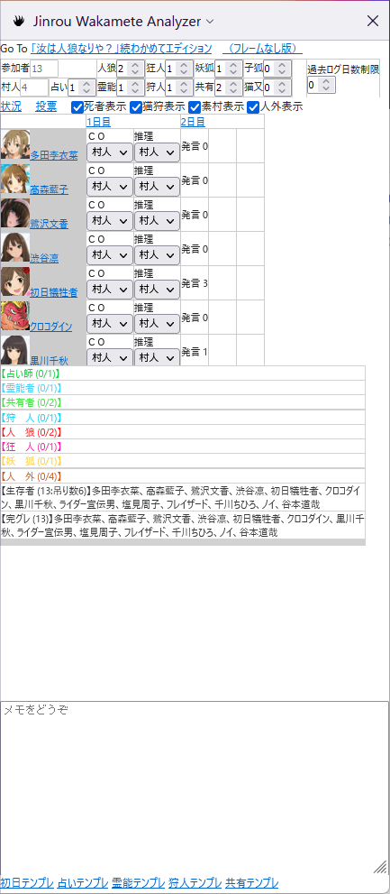
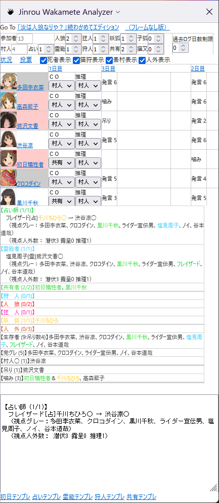

# about Jinrou-Wakamete-Analyzer

Support tool for online "Are You a Werewolf?" game in Wakamete Server ( http://jinrou.dip.jp/~jinrou/ ).
You get easier to correct and analyze Chat Log.
It is Sidebar Plugins for Mozilla Firefox.

Firefoxのサイドバーを用いた、人狼ゲーム・わかめて鯖 http://jinrou.dip.jp/~jinrou/ 向けログリアルタイム分析ツール。

# Support Language

Japanese only, because Wakamete Server can support only Japanese.

わかめて鯖が日本語なので、日本語以外対応しません。あしからず。

# Request for you （お使いの皆様へお願い事項）

まず、バグ報告についてのお願いです。

1. *村番号の控え* 、および、 *スクリーンショットの取得* をお願いします。
1. 基本的には Issueチケット による報告をお願いいたします。  
   https://github.com/stageleft/jinrou-wakamete-analyzer/issues から、「New Issue」をクリックして報告を作成願います。作者によるバグ調査の際は、村のログおよびスクリーンショットが必要となります。
    * Github アカウントをお持ちでない等、 Issue チケットを操作できない事情がある場合は、別途個別対応とさせてください。

次に、機能の強化および削除に関する要望についてのお願いです。

1. 要望は、基本的にバグ報告と同様、 Issueチケット による報告をお願いいたします。  
1. 要望がある場合は、内容および理由について、できるだけ具体的に記載願います。
    * 技術的困難度および将来拡張性の観点から、要望の内容と全く異なる形での対応を行う場合があります。
1. 採用されなくても泣かないでください。
    * 技術的困難度、レイアウト、および将来拡張性の展望から、採用できない要望も多数考えられます。
    * 採用できない場合は、原則として採用できない理由を Issue チケットに残します（あるいは、すでに残っているかもしれません）

# How to Install （どうやってインストールするの？）

## Install （普通にインストールする場合）

https://addons.mozilla.org/ja/firefox/addon/jinrou-wakamete-analyzer/ からインストールしてください。

## Update （インストールしたものを最新化する場合）

1. アドオンマネージャー（ about:addons ）にアクセスし、インストールされている Jinrou Wakamete Analyzer のバージョンを確認してください。  
   右上のメニュー（横線３本アイコン）→アドオン、あるいは、Ctrl+Shift+Aでもアクセスできます。
1. https://addons.mozilla.org/ja/firefox/addon/jinrou-wakamete-analyzer/ にアクセスし、「詳しい情報」メニューから最新バージョンを確認してください。  
   バージョンが同じであれば、最新化されていますのでここで終わりです。
1. アドオンマネージャー、先程バージョンを確認した画面にて、設定アイコン（右上の歯車）から「今すぐ更新を確認」をクリックします。
1. 同じ画面にて、インストールされている Jinrou Wakamete Analyzer のバージョンが最新と一致していれば完了です。

## Temporarily install for your Development（自分でカスタマイズしたい場合）

1. 本ページ右上（右中？）の、「Clone or download」から、Download ZIP にてファイルをダウンロードする。
1. https://developer.mozilla.org/ja/docs/Mozilla/Add-ons/WebExtensions/Packaging_and_installation の、
「ディスクから読み込む」セクションに従ってインストールする。  
   インストール完了後は、 about:debugging のページを閉じてよい。  
   なお、起動のたびにインストールする必要があるため、 about:debugging をブックマークするとよい。
1. 満足の行くカスタマイズができた場合、ご自身でカスタマイズしたパッケージをインストールできる。
    1. https://developer.mozilla.org/ja/docs/Mozilla/Add-ons/Distribution を熟読する。
    1. manifest.json はご自身の情報に合わせて書き換える。 version と、 applications.gecko.id の書き換えは必須である。
    1. ファイル一式を zip 圧縮し、`*.xpi` ファイルとして保存する。
    1. https://addons.mozilla.org/ja/firefox/ にアクセスし、右上の「開発者センター」にアクセスする。あとは適宜。

# How to Use （どうやって使うの？）

本説明は、バージョン v1.2 についての説明であり、お使いのバージョンと異なる可能性がある。
また、スクリーンショットは 村（１５３２５４番）終了後の状態に同バージョンを適用したものだが、純粋な村終了後の状態ではなく、一部表示の不整合がある。

1. サイドバーを表示する（下図）。  
   サイドバー上部の「Go To 「汝は人狼なりや？」続わかめてエディション」をクリックすることで、同サイトのフレームなし版にアクセスする。

1. 村民登録を行い、ゲームの開始を待つ。
  このとき、ツールの仕様の都合上、以下の注意点がある。

    1. 複数のウィンドウを開いてはいけない。
    1. 複数の画面で村を見てはいけない。

「観戦」、「ログイン → 旅人」あるいは、「過去ログ → 最近の記録」からログインした場合は、正しい表示とならない。
１日目昼から観戦している場合には、ツールの雰囲気がおおよそわかる状態にはなるので、村が立てば練習することは可能。

1. 村が始まったところで、サイドバーの上部に配役を入力する。  
   配役が入力されると、CO状況のまとめテキストがサイドバー中央に表示される。  
  
サイドバー中央の「状況」表示をクリックすると、この表がサイドバー下部のメモエリアに追記される。    
サイドバー上部、配役入力部分の直下の「状況」をクリックするとこの画面に戻る。

1. サイドバー上部、配役入力部分の直下の「投票」をクリックすると、サイドバー中央にてこれまでの投票履歴を確認できる。  
  
サイドバー中央の投票結果表をクリックすると、クリックした投票のみがサイドバー下部のメモエリアに追記される。    
    1. (v1.8以降) 役職CO者、人外推理者については、名前および投票結果に文字色がつく。
        * 文字色は、わかめて過去ログの役職者に準ずる。人外推理者は人狼とも妖狐ともつかない色（カラーコード #cc4400、橙色～琥珀色）をつけている。
    1. (v1.8以降) 本ツールがグレランと判断した場合、その投票には以下のセル色がつく。
        * 最多得票者へ投票した、役職CO者以外のセル → 赤を薄くした色（カラーコード #ffcccc）。
        * 役職CO者以外で得票0票者のセル → 黄色を薄くした色（カラーコード #ffffcc）。
        * それ以外のセル → 灰色（カラーコード #cccccc）。
        * （参考）本ツールでのグレラン判断基準は、「最多得票者の得票数が、投票者の半分未満」と定義する。   
          したがって、全ランなど特に指示がない投票もグレランに含むことがあり、また、消極的村柱投票で得票が集中しすぎた場合はグレラン指示があってもグレランに含まない。

1. サイドバー中央上部の推理表について。
    1. 進行に応じてCO状況、人外の推理状況、占い・霊能・狩人護衛状況、を選択入力する。  
       このとき、あらかじめ選択入力をしておいた状態にて、サイドバー上部、配役入力部分の直下の「死者表示」「猫狩表示」「素村表示」「人外表示」各々のチェックボックスをクリックし、チェックをつけ外しすることで、表示する参加者の絞り込みを行うことができる。
       本機能は、占い結果・霊能結果の入力容易化に用いるとよい。  
         
    ※日数は１日目を除き、逆順で表示される（名前と近い側が最新情報）。  
    ※「猫狩表示」のチェックボックスは、共有CO者にも適用される。  
    ※1日目昼（村開始前）においては、CO状況を適切に入力できないことがある。
    1. 各々の発言数、死亡理由を表示する。  
      ただし、最終日において仕様上の不具合あり、下記「Bugs that cannot be fixed （ざんねんな仕様）」を参照のこと。
    1. 左側「村人名」または、上部「日付名」をクリックすると、サイドバー中央にてこれまでの発言履歴を確認できる。  
       サイドバー中央の発言表をクリックすると、クリックした発言のみがサイドバー下部のメモエリアに追記される。  
         

1. サイドバー下部、メモエリアの下のテンプレリンクには、進行に応じて、占いCO・霊能CO・狩人CO・共有の簡単なテンプレートを提供している。  
   クリックすることで、サイドバー下部（リンク直上）のメモエリアに追記される。   
  
   画像は共有テンプレとして、全ての生存者に対して、「指定：＜CNフルネーム＞COありますか？」の文字列を提供したもの。  
   必要に応じて、文章の追加や文字の削除を行ってから使用すること。

1. 村の進行に合わせてログは自動で取り込まれるが、サイドバー下部の各種情報の自動更新は周期が遅い（※）ので、必要に応じて手動で更新することが望ましい。  
    1. 自動更新中に文字を入力すると、入力した内容が不正に削除されることがある。  
       自動更新を止めるためには、自動更新タイミングの前に、自ら更新する、発言を入力する、といった操作を行う。

※注意事項：自動更新を一度止めたら、必ず手動更新してください。さもなくば自動更新が働きません。  
※注意事項：夜の占い師は、占い完了するまで自動更新ありません。いいからすぐ占え。

1. 発言の入力時、１行あたりの文字数が４０文字を超えると、文字入力エリアが赤くなる。   
   これは、潜在的にわかめてサーバ禁止行為の【ログ破壊】リスクがあることを意味する。   
   ただしリスク検出のみであり、必ずログ破壊になるとは限らないので、そのまま発言することにシステム上支障はない。

# Bugs that cannot be fixed （ざんねんな仕様）

* 推理表に表示された死亡理由にて、最終日吊られが突然死で表示される。 https://github.com/stageleft/jinrou-wakamete-analyzer/issues/16
* 直前の昼に吊られた人を、推理表で占いの対象にできる。 https://github.com/stageleft/jinrou-wakamete-analyzer/issues/46

# Troubleshooting （問題が発生した場合の対処例）

* 村に参加したのに、推理表が表示されない
    * デバッグメニューのURL（ about:debugging ）に入り、このFirefox → 本ツールの「調査」をクリックしてデバッグツールを起動します。「コンソール」メニューをクリックして、表示されている文字を確認してください。  
        * 赤いセル・赤文字で「 NS_ERROR_FILE_NOT_FOUND 」の文字を含むエラーが何度も表示されている場合、Firefoxの再インストールを実施してください。（ 過去事例：Firefox70 で動かない  https://github.com/stageleft/jinrou-wakamete-analyzer/issues/71 ）

# Modification （改造してよい？）

Mozilla Public License Version 2.0 に従った範囲で、自由に改造して、どうぞ。

具体的な使い方は、インストール方法の「Temporarily install for your Development（自分でカスタマイズしたい場合）」を参照願います。

# Special Thanks

* ｢汝は人狼なりや？｣続わかめてエディション サーバー管理者およびWiki管理者各位  
  http://jinrou.dip.jp/~jinrou/
* 「わかめてモバマス人狼」GMおよび参加者各位  
  https://twitter.com/mobamasjinrou  
  https://wikiwiki.jp/cinderejinro/

